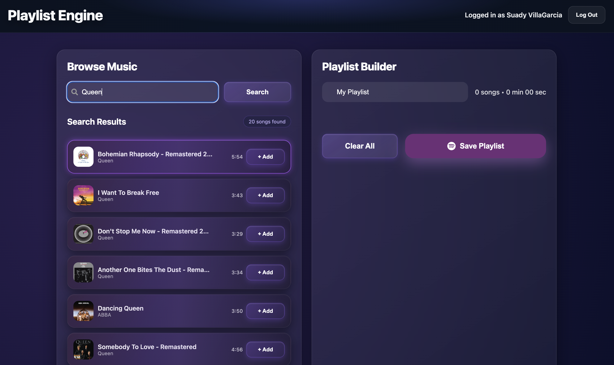
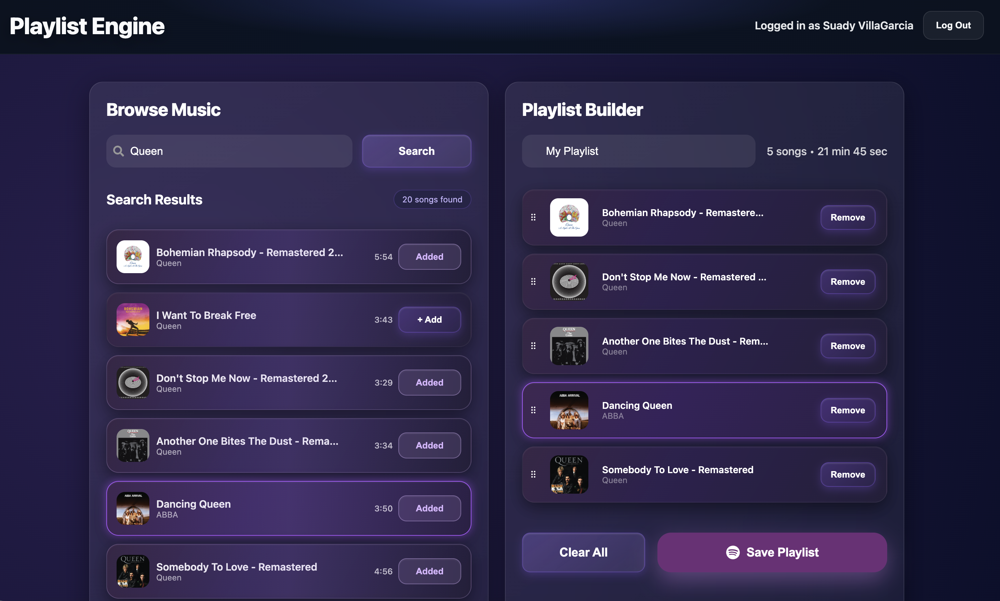
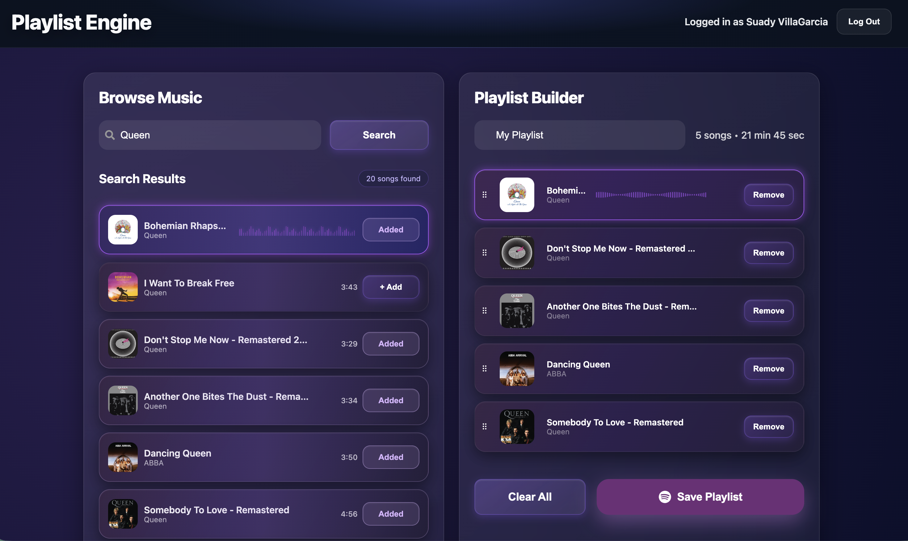
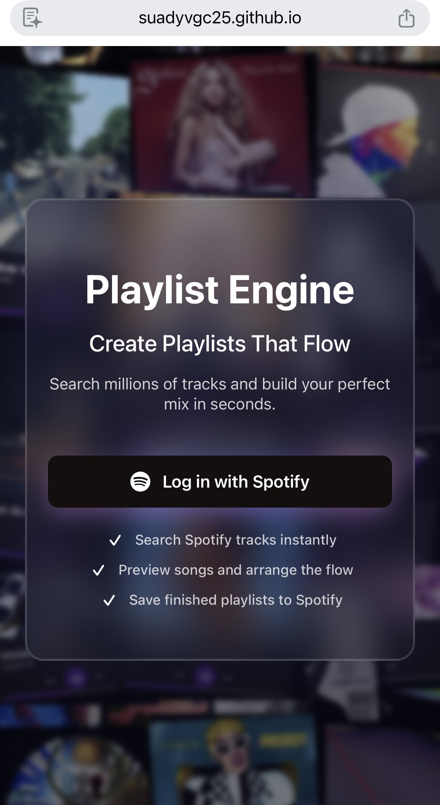
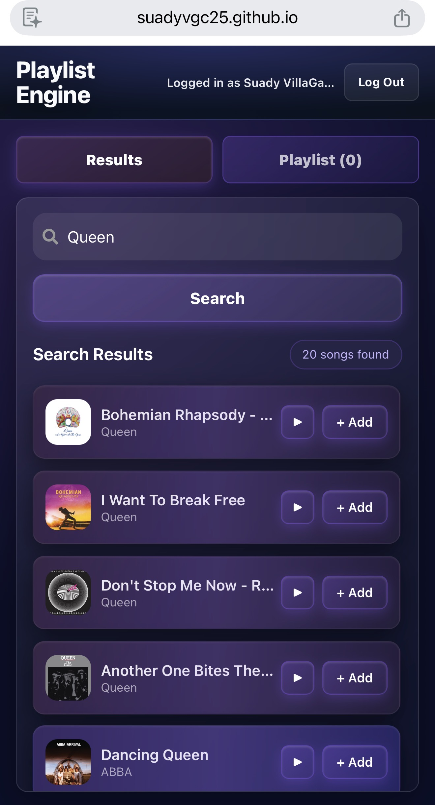
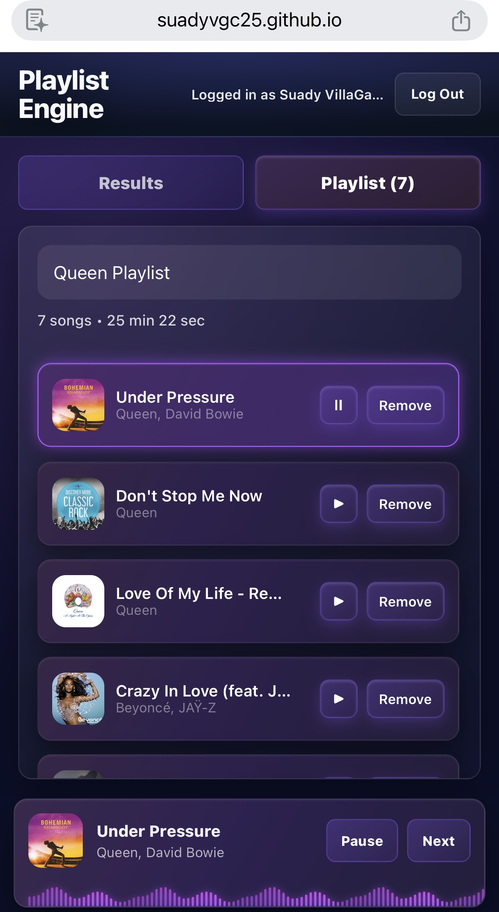
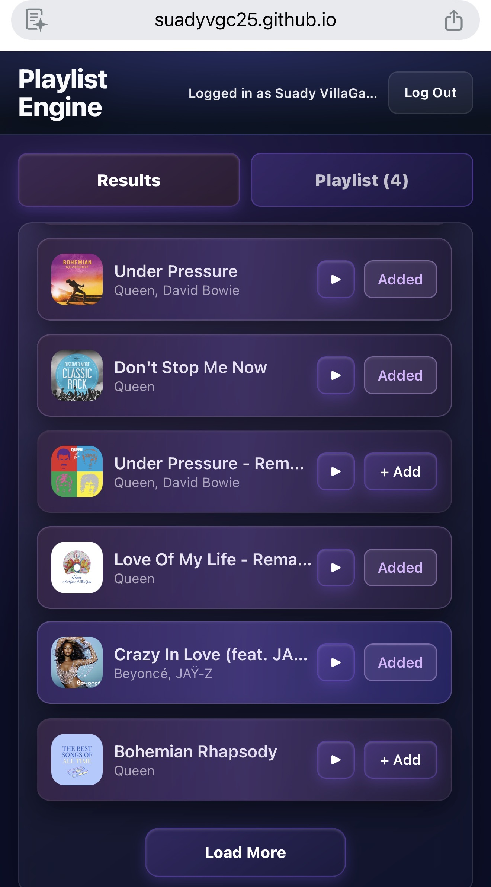
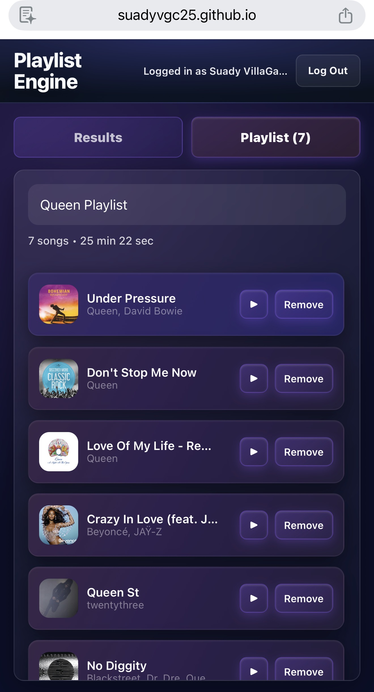

# Playlist Engine

Build better playlists by hearing songs before you add them.

Playlist Engine is a Spotify-powered playlist builder that lets users search tracks, preview songs, arrange playlist order with drag and drop, and save the final mix back to Spotify. It is designed to make playlist creation feel faster and more interactive than building directly inside a streaming app.

## Live Demo
[View the live app](https://suadyvgc25.github.io/playlist-engine)

## The Problem
Creating playlists in streaming apps often involves guessing how songs sound or how they will flow together. This leads to disjointed playlists and a frustrating trial-and-error process.

## The Solution

Playlist Engine introduces a seamless preview workflow:

- Instantly listen to tracks before adding them
- Compare songs side-by-side
- Build and refine playlists in one focused workspace

## Features

### Authentication
- Log in with Spotify using the PKCE OAuth flow
- Secure token handling with no client secret exposed
- Seamless connection to the user’s Spotify account

### Search & Discovery
- Search Spotify tracks by song, artist, or keyword
- Show top 20 unique results, then load more in batches of 10
- Cap results at 50 unique tracks per search
- Remove duplicate and duplicate-looking tracks across results
- Preserve scroll position when loading more

### Playback & Preview
- Preview songs directly from search results and playlist
- Hover over search results on desktop to instantly preview tracks
- Tap play controls on mobile for touch-friendly preview playback
- Mobile-friendly mini player with play/pause and next controls
- Skip tracks with no playable preview
- Seamless playback across search and playlist

### Playlist Management
- Add tracks from search results
- Reorder songs with drag and drop
- Remove individual tracks or clear the playlist
- Prevent duplicate additions with visual “Added” state
- Save playlists to Spotify

### Mobile Experience
- Tap-to-play preview playback with no hover dependency.
- Optimized touch interactions for playback, adding tracks, and drag behavior.
- Responsive layout with an adaptive mobile login background.

## Tech Stack

- React 19
- TypeScript
- Vite
- Sass modules
- React Router
- Spotify Web API(PKCE OAuth flow)
- Deezer public search API for mobile-safe audio previews (preview fallback)
- Optional iTunes Search API proxy fallback for local/server-backed preview lookup
- `@dnd-kit` for drag and drop

## How It Works

1. User searches for tracks via Spotify API
2. Results render with preview capability
3. User previews tracks (hover on desktop, tap on mobile)
4. Tracks are added and arranged in a playlist
5. A centralized preview player syncs playback globally
6. Final playlist is saved to Spotify

## Screenshots





<p>
  
  
  
  
  
</p>

## Demo
(Add a short GIF or video here showing search → preview → drag → play)

## Technical Highlights 

### Overview

- Centralized audio playback system using a shared Audio instance and global state
- Cross-device interaction model (hover on desktop, tap on mobile)
- Progressive search loading with deduplication and scroll preservation
- Mobile-safe preview fallback pipeline (Spotify → Deezer → optional iTunes proxy)
- Layout stability techniques to prevent UI shifting during dynamic interactions
  
### Preview Player State
The preview player is centralized in **src/hooks/useAudioPlayer.ts**. Instead of letting each row manage its own audio element, the app uses a single Audio instance plus shared React state for:

* currentTrack
* isPlaying
* isHoverPreview
* tracksWithoutPreviews
  
This keeps playback synchronized between search results, playlist items, and the mobile mini player. The hook also tracks playback source and queue position so the app can move to the next playable track without losing context.

A request ID guard prevents race conditions when users move quickly between tracks. If multiple preview lookups resolve out of order, only the latest request is allowed to update playback state.

### Hover Vs Mobile Interactions
Desktop and mobile use different interaction models on purpose:

* On hover-capable devices, search result previews start on mouseenter and stop on mouseleave.
* On touch devices, previews are triggered through explicit play buttons instead of hover.
* Touch-specific handlers prevent accidental double-fires between pointer, touch, and click events.
* Drag listeners are attached differently on mobile vs desktop so reordering and playback do not fight each other.

That logic lives mainly in:

* src/components/SearchResults/SearchResultTrackItem.tsx
* src/components/Playlist/SortableTrackItem.tsx
  
### Preventing Layout Shift
A big part of the polish was making dynamic UI changes feel stable. I solved layout shifting in a few ways:

* Reserved fixed-width UI slots for durations, action buttons, and waveform areas so rows do not jump when playback state changes.
* Restored the search panel scroll position after loading more results so the list does not snap back to the top.
* Stored drag overlay dimensions at drag start so the overlay matches the source row instead of resizing mid-drag.
* Added mobile-only spacing for the mini player using CSS custom properties so the fixed player does not cover scrollable content.
  
Relevant files:

* src/pages/HomePage.tsx
* src/App.module.scss
* src/components/SearchResults/SearchResults.module.scss
* src/components/Playlist/Playlist.module.scss
  
### Component Structure
I split the app by responsibility so UI, state, and API logic stay isolated:

* pages/: route-level orchestration such as search, drag-and-drop context, and layout state.
* hooks/: reusable stateful logic like audio playback and playlist saving.
* components/: presentational UI pieces such as search results, playlist items, header, and mini player.
* services/spotify/: auth, API calls, track mapping, playlist creation, and preview lookup.
* utils/ and types/: shared formatting helpers and TypeScript models.
  
This structure made it easier to keep the React components focused while moving side effects and platform-specific logic into hooks and services.

## Challenges & Solutions

### 1. Preview Availability Across Devices
Spotify does not always provide a usable preview_url, especially in a way that works consistently across mobile browsers. To make previews reliable, I built a fallback pipeline:

1. Use Spotify's native preview URL when available.
2. Try Deezer for a matching preview.
3. Optionally fall back to an iTunes proxy when the host supports it.
   
This gave the app a much better chance of finding playable previews without making the user think about the complexity behind it.

### 2. Duplicate-Looking Search Results
Spotify search can return duplicate-looking tracks across albums, remasters, and alternate releases. I handled this in two layers:

* API-level deduping in src/services/spotify/search.ts
* Client-level deduping when appending new result batches in src/pages/HomePage.tsx. This keeps search results cleaner and makes the playlist-building experience feel more intentional.

### 3. Touch-Friendly Drag And Playback
Reordering songs and previewing them both depend on user gestures, so mobile needed extra care. I tuned drag sensor thresholds, delayed touch activation, and separated mobile play controls from drag handles so users can tap confidently without triggering unintended drag behavior.

## What I Learned

* Managing shared state across independent UI systems
* Designing different interaction models for mobile vs desktop
* Handling unreliable third-party APIs with fallback strategies
* Preventing UI instability in highly interactive components

## What I'd Improve Next

* Add playlist persistence so in-progress work survives refreshes.
* Add recommendations based on the current playlist.
* Add keyboard shortcuts and stronger accessibility support for drag-and-drop flows.
* Add automated tests around audio state, search deduping, and playlist save behavior.
* AI-generated playlist naming

## Getting Started

### 1. Install Dependencies

```bash
npm install
```

### 2. Create Environment Variables

Create a `.env.local` file in the project root:

```bash
VITE_SPOTIFY_CLIENT_ID=your_spotify_client_id
VITE_SPOTIFY_REDIRECT_URI=http://127.0.0.1:5173/callback
VITE_SPOTIFY_SCOPES=playlist-modify-public playlist-modify-private user-read-email user-read-private
```

Do not commit `.env.local`. It is for local secrets and app-specific configuration.

### 3. Configure Spotify

In the Spotify Developer Dashboard:

1. Create or open your Spotify app.
2. Add the same redirect URI used in `.env.local`.
3. For local development, use:

```bash
http://127.0.0.1:5173/callback
```

The redirect URI must match exactly, including protocol, host, port, and path.

### 4. Start the App

```bash
npm run dev
```

Then open the local URL printed by Vite, usually:

```bash
http://127.0.0.1:5173
```

## Available Scripts

```bash
npm run dev
```

Starts the Vite development server.

```bash
npm run typecheck
```

Runs TypeScript checks without generating build files.

```bash
npm run lint
```

Runs ESLint across the project.

```bash
npm run build
```

Runs TypeScript checks and creates a production build in `dist`.

```bash
npm run preview
```

Serves the production build locally for review.

```bash
npm run deploy
```

Builds and deploys the `dist` folder with `gh-pages`.

## Project Structure

```text
src/
  components/       Reusable UI pieces such as SearchBar, Playlist, MiniPlayer, and LoginHero
  hooks/            Playlist and audio playback state
  pages/            Route-level screens
  services/spotify/ Spotify auth, API requests, search, playlist saving, and mapping helpers
  styles/           Shared global styles
  types/            Shared TypeScript types
  utils/            Formatting helpers
```

## Key Files

- `src/pages/HomePage.tsx` coordinates search, playlist building, drag and drop, and the mini-player.
- `src/hooks/useAudioPlayer.ts` handles preview lookup, playback state, pause/play behavior, and next-track logic.
- `src/hooks/usePlaylist.ts` handles playlist state and saving to Spotify.
- `src/services/spotify/auth.ts` handles Spotify login, token storage, refresh, and logout.
- `src/services/spotify/search.ts` handles Spotify search plus Spotify, Deezer JSONP, and optional iTunes-proxy preview lookup.
- `api/itunes/search.js` provides an optional iTunes preview proxy for server-capable hosts.
- `vite.config.js` configures React and mounts the local iTunes preview proxy during development.

## Production Checklist

Before shipping or deploying, run:

```bash
npm run typecheck
npm run lint
npm run build
```

Also confirm:

- Spotify redirect URI matches the production URL.
- Required Spotify scopes are configured.
- Search results show Load More until 50 unique tracks are displayed, using broad searches like `a` or `love`.
- Search results do not show obvious duplicates after multiple Load More actions.
- Already-added search results are visibly marked as Added.
- Real iPhone preview playback works after a fresh search, not only after desktop previews were already resolved.
- The production bundle is not making direct browser requests to Apple/iTunes metadata URLs.
- GitHub Pages preview lookup uses Deezer JSONP, or another production host provides `VITE_ITUNES_PROXY_URL`.
- Mobile and desktop playback controls still work after deployment.

## Production Notes
* The app uses Spotify OAuth with PKCE.
* Search results are loaded progressively instead of traditional pagination.
* Search result deduping happens both during API mapping and during client-side append operations.
* Mobile playback uses explicit controls and a mini player rather than hover interactions.
* Preview lookup relies on Spotify first, then fallback providers when needed.

## Audio Preview Notes

Spotify search results do not always include playable preview URLs. The app therefore resolves preview audio through a fallback pipeline instead of relying only on Spotify's `preview_url` field.

The current preview lookup order is:

1. Use Spotify's `preview_url` when Spotify provides one.
2. Search Deezer for a matching song and artist, then use Deezer's direct MP3 preview URL.
3. Optionally fall back to an iTunes Search API proxy when a proxy is available.

### Why Deezer Uses JSONP

Mobile Safari and iOS Chrome have two important constraints that affect this app:

- Direct Apple/iTunes metadata requests from an iPhone browser can be redirected to `musics://...` URLs. Browser JavaScript cannot fetch those app-deep-link URLs, so preview lookup fails before the app receives an audio URL.
- Deezer's JSON API can return valid preview MP3 URLs, but iPhone Safari blocks normal `fetch()` calls from the GitHub Pages origin because of CORS.

To support mobile playback on a static GitHub Pages deployment, `src/services/spotify/search.ts` uses Deezer's JSONP callback mode for preview lookup. JSONP loads the response through a temporary `<script>` tag instead of `fetch()`, so it is not blocked by the same CORS checks. The response includes direct MP3 preview URLs that can then be assigned to the app's audio player.

This JSONP path is intentional. Replacing it with a normal `fetch("https://api.deezer.com/search...")` call can make previews work on desktop while breaking fresh searches on real iPhones.

### iTunes Proxy Fallback

During local development, `vite.config.js` mounts `/api/itunes/search` as a server-side proxy for iTunes lookup. This keeps Apple metadata requests out of the browser and avoids the iPhone `musics://` redirect issue.

The `api/itunes/search.js` file can also be used as a serverless function on a host like Vercel. GitHub Pages is static and cannot run that API route. For GitHub Pages, the mobile-safe Deezer JSONP lookup is the production path.

If a production host provides an iTunes proxy endpoint, set `VITE_ITUNES_PROXY_URL` to that endpoint at build time. Without that variable, production skips the iTunes fallback and relies on Spotify plus Deezer previews.

### Mobile Playback Behavior

iPhone audio playback is stricter than desktop playback. The app pre-resolves preview URLs during search when possible, then the tap on a play button starts playback from an already known audio URL. If a track has no usable preview, the app marks it as unavailable and skips it when using next-track playback.

When debugging mobile preview issues, inspect the app on the real iPhone with Safari Web Inspector. Desktop responsive mode can be misleading because it may keep preview URLs that were already resolved before switching to an iPhone viewport.

## Search Result Loading

The search experience is designed around a mobile-first browsing pattern:

1. A new search shows the first 20 unique tracks.
2. The user can press Load More to append the next 10 unique tracks.
3. The visible result list stops at 50 unique tracks.
4. The Load More button disappears when the app has displayed 50 unique tracks or Spotify stops returning additional tracks.

This replaced the earlier result-count selector because choosing between 20, 25, and 50 results was less natural on mobile. A progressive Load More pattern keeps the first screen fast and easier to scan, while still letting users browse deeper when the first set is not enough.

### Why Spotify Is Paged Internally

Spotify's Search API is requested in small pages. The app keeps each Spotify request at 10 tracks, then combines pages in the client. This avoids sending an oversized request and gives the UI predictable batches:

- Initial search: enough 10-track Spotify pages to collect up to 20 unique tracks.
- Load More: additional 10-track pages until up to 10 more unique tracks are found.
- Maximum visible results: 50 unique tracks.

The app may scan deeper than 50 raw Spotify results. This is intentional. The visible cap is 50 unique tracks, not "the first 50 raw objects Spotify returned." Spotify can return duplicates, alternate releases, remasters, clean/explicit variants, or the same song appearing on different albums. If the app stopped after inspecting only 50 raw results, deduping could leave the user with far fewer than 50 visible songs.

### Duplicate Handling

Search result deduping happens in two layers:

- `src/services/spotify/search.ts` dedupes each Spotify response by Spotify track ID and by a normalized track-title-and-artist key.
- `src/pages/HomePage.tsx` dedupes again when appending new pages so duplicates cannot reappear across Load More actions.

The ID check catches exact Spotify duplicates. The normalized name-and-artist check catches cases where Spotify gives different IDs to what looks like the same song in the UI, such as the same track appearing on a single, album, compilation, or deluxe edition.

### Scroll And Playback Behavior

Load More appends tracks to the existing list instead of replacing the result set. This keeps the active preview track stable whenever possible because the current track object remains in the rendered results. The search panel also restores its previous scroll position after new results are appended, so pressing Load More does not jump the user back to the top.

Tracks already added to the playlist remain visible in search results, but their add button changes to Added and becomes disabled. This gives the user clear feedback without hiding search context or changing result order.


